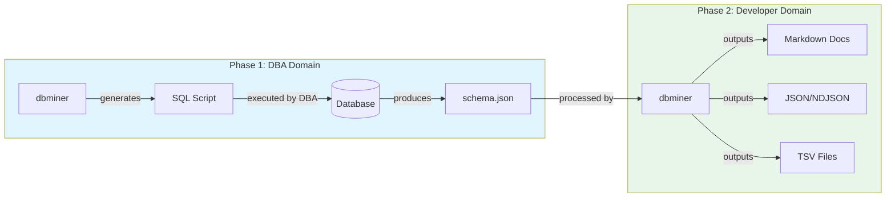
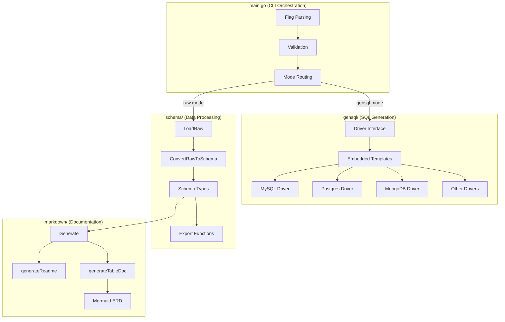
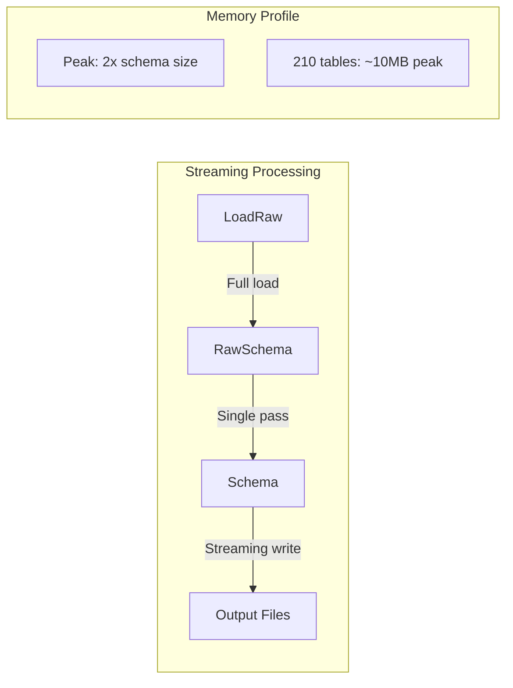
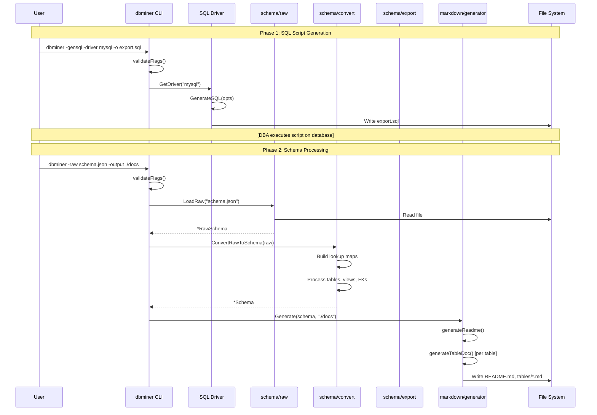
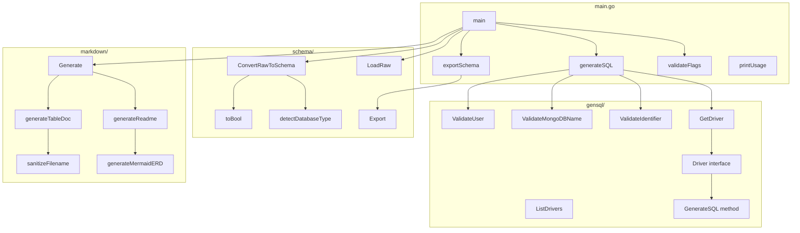
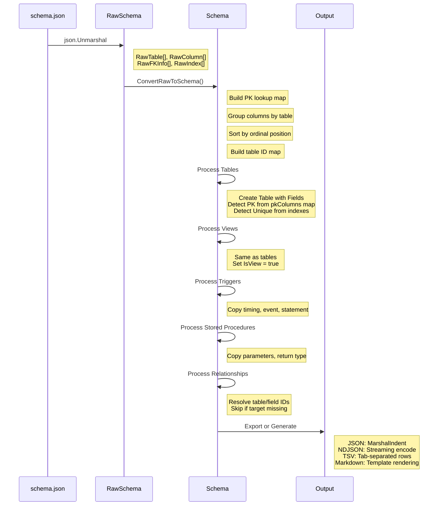

# dbminer Architecture

**Version:** 0.9.0  
**Last Updated:** 2026-07-20

---

## Architecture and Design Choices

### Overview

dbminer is a multi-database schema documentation generator designed around a three-phase workflow that separates concerns between DBA access and developer tooling:



### Core Design Principles

1. **Separation of Privileges**: The application never requires direct database access. SQL scripts run in DBA context; processing runs in developer context.

2. **Pure Transformation Core**: ~70% of code is pure functions with no I/O, enabling fast unit tests without mocking.

3. **Driver Abstraction**: Database-specific SQL generation is encapsulated in driver implementations using Go's `text/template`.

4. **Format Agnostic Output**: The internal `Schema` type is the canonical representation; exporters convert to target formats.

### Package Architecture



### Key Design Decisions

| Decision | Rationale |
|----------|-----------|
| No database drivers | Eliminates credential management, connection complexity, and privilege escalation risks |
| Embedded SQL templates | Single binary distribution; templates versioned with code |
| NDJSON for LLM | Streaming-friendly; fits within context windows better than nested JSON |
| TSV split files | Enables selective import into spreadsheets without memory issues |
| Mermaid for ERDs | Renders in GitHub, VS Code, many documentation systems natively |

---

## Assumptions

### Input Data

1. **SQL Collector Output**: Raw JSON follows the structure produced by the embedded SQL scripts
2. **MySQL Nullable Format**: Columns may use "YES"/"NO" strings instead of booleans
3. **Version Strings**: Database type detected from version string patterns (e.g., "MySQL 8.0.32", "PostgreSQL 15.2")
4. **UTF-8 Encoding**: All input files are UTF-8 encoded

### Database Capabilities

1. **Information Schema**: Target databases have INFORMATION_SCHEMA or equivalent metadata views
2. **JSON Output**: SQL Server, MySQL, PostgreSQL can output JSON natively
3. **MongoDB**: Version 4.4+ for `$sample` aggregation and schema inference

### Runtime Environment

1. **File System**: Write access to output directory
2. **No Network**: Application operates entirely offline after script generation
3. **Go 1.21+**: Uses embed.FS for templates

---

## Edge Cases

### Schema Processing

| Edge Case | Handling |
|-----------|----------|
| Missing FK target table | Relationship skipped silently (logged in debug) |
| Composite primary keys | All columns marked as PK |
| Multi-column unique indexes | Index marked unique; individual columns NOT marked unique |
| Views with no columns | Empty Fields array; still generates documentation |
| Empty schema (no tables) | Warning printed; empty output generated |
| Circular FK references | Processed without issue; Mermaid handles cycles |

### Name Handling

| Edge Case | Handling |
|-----------|----------|
| Special characters in names | Sanitized for filenames and Mermaid IDs |
| Unicode table/column names | Preserved in output; sanitized only for file paths |
| Reserved SQL keywords | Quoted in templates where needed |
| Empty names | Replaced with "_invalid_" placeholder |

### Data Types

| Edge Case | Handling |
|-----------|----------|
| Nullable as "YES"/"NO" string | `toBool()` recognizes both formats |
| Nullable as 0/1 integer | `toBool()` handles numeric types |
| CharMaxLen as string or int | Treated as string; JSON handles both |
| NULL default values | Preserved as empty string |

---

## Performance and Efficiency

### Memory Efficiency



- **Single-Pass Conversion**: RawSchema to Schema in one traversal
- **Streaming NDJSON**: One record written at a time, not buffered
- **No Index Rebuilding**: Uses maps for O(1) lookups during conversion

### Time Complexity

| Operation | Complexity | Notes |
|-----------|------------|-------|
| LoadRaw | O(n) | Linear in file size |
| ConvertRawToSchema | O(t + c + i + r) | Tables + columns + indexes + relationships |
| Export JSON | O(n) | Linear in schema size |
| Export NDJSON | O(n) | Streaming, constant memory |
| Export TSV | O(n) | Streaming, constant memory |
| Generate Markdown | O(t * r) | Tables * relationships for ERD |

### Benchmarks (GoAnywhere 210 tables)

| Operation | Time | Memory |
|-----------|------|--------|
| Load + Convert | ~50ms | ~8MB |
| Export JSON | ~20ms | ~4MB |
| Export NDJSON | ~25ms | ~1MB |
| Generate Markdown | ~150ms | ~12MB |

---

## Data Flow and Control Logic

### Operational Flow



### Code Relations



### Data Transformation Sequence



---

## Dependencies

### Go Modules

```go
module criticalsys.net/dbminer

go 1.21

// No external dependencies - standard library only
```

### Standard Library Packages

| Package | Usage |
|---------|-------|
| `flag` | CLI argument parsing |
| `fmt` | Formatted I/O |
| `os` | File operations |
| `path/filepath` | Cross-platform paths |
| `encoding/json` | JSON marshal/unmarshal |
| `text/template` | SQL template execution |
| `embed` | Embedded SQL templates |
| `regexp` | Identifier validation |
| `sort` | Slice sorting |
| `strings` | String manipulation |
| `time` | Timestamps |
| `io` | Writer interface (errWriter) |

### Embedded Resources

| Resource | Purpose |
|----------|---------|
| `gensql/templates/*.sql` | SQL export scripts per driver |
| `gensql/templates/mongodb.js` | MongoDB schema inference script |

### Build Dependencies

| Tool | Version | Purpose |
|------|---------|---------|
| Go | 1.21+ | Compilation |
| gosec | latest | Security linting (optional) |
| golangci-lint | latest | Code quality (optional) |

### Runtime Dependencies

**None** - dbminer is a statically-compiled single binary with no external dependencies.

### Test Dependencies

| Dependency | Purpose |
|------------|---------|
| `testing` | Standard Go test framework |
| `t.TempDir()` | Portable temporary directories |
| GoAnywhere sample data | Realistic test fixtures |

---

## Security Considerations

See [README.md#security-assessment](README.md#security-assessment) for the detailed security assessment.

### Summary

- No database credentials in application
- Input validation prevents SQL injection in generated scripts
- Output files use safe permissions (0644 files, 0755 directories)
- No network communication
- No external dependencies reduces supply chain risk
